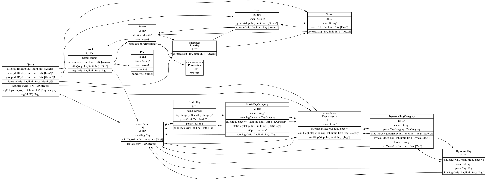

# Sample application for GraphQL

## Features

* *Multi stage*: Uses Multi stage build for building the container
* *Database ownership*: Takes care of the database schema by itself
* *Configuration*: all runtime parameters are passed either via environment variables or command line arguments
  * Kubernetes ConfigMap
  * Kubernetes Secrets
* *Logging*:
  * JSON logging
  * Logging of trace_id and span_id for correlation
* Authentication: Validate the JWT token
  * Token check can be disabled for easier development
  * The following entries are written to the span
    * enduser.id
    * enduser.roles
* OpenTelemetry: Exposes traces in OTLP to a configurable endpoint
* *Probes*: Exposes readiness and liveness probes
  * /health endpoint
* Version awareness: Exploses the own version via /version endpoint

## Diagram

